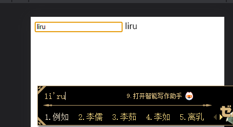

- ssr问题
	- 访问不了localstorage（放到了页面加载后在执行）
	- 打包部署很麻烦
		- 使用静态导出，在config中添加配置项
	- 一直在打包`Creating an optimized production build`
		- 关闭该项目正在运行的终端再打包
		- 删除node_modules和.next后重新安装打包
- vue3中的一个问题
	- 
	- 在vue的v-model的输入框中，正常输入字母和汉字可以监听到，但是输入法中的不会监听到，如上图
	- 但是如果直接使用原生的input事件去监听，我们可以发现拼字的时候也会被监听到，我们该怎么去实现他这个功能呢？
	- 通过msn我们可以发现一个属性
-