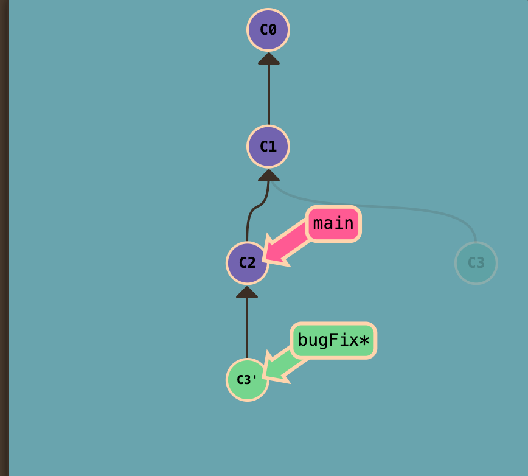
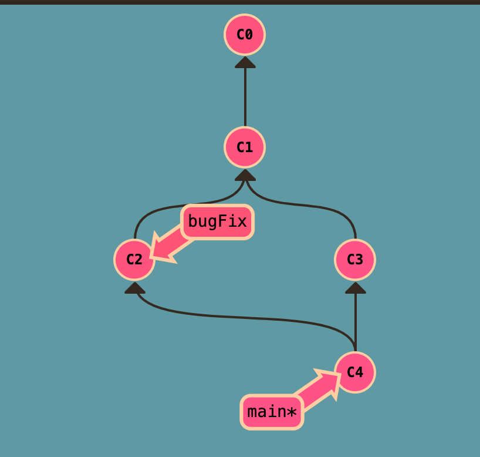

- 每日必做
	- TODO 十篇公众号文章
		- git rebase和merge的区别 #git
			- 根据例子分析
			- rebase 和 merge的区别，rebase和merge都需要解决冲突
			- rebase 实际上取出提交记录，复制他们，然后在另一个地方逐渐放下去，也可以理解为 rebase是将祖先重新指向了新的master
				- 
				- 优势可以创建更线性的提交历史
				  id:: 6576eba7-0088-49b3-8496-c20b529b373f
				- 因此使用rebase一定注意是私人开发，多人协作容易导致别人依赖从而出现错误
			- merge是将当前分支和master分支合并并生成一个新的提交
				- 
			- 总的来说 git merge 会将两个分支按照时间排序然后合并成一个新的commit，最后分支树呈现非线性结构，git rebase 会将dev当前提交复制到master最新提交之后，从而形成一个线性的提交
		-
	- TODO 阅读两篇英文小短文
- #感悟
	- 关于自身成长篇，对于我自身的编程提升，从我刚开始入编程开始，一开始我们都处于一个教学阶段，然后一起学习，我当时为什么突出，其一是因为我过早接触到了for循环，导致我不需要过久的时间去消化，我腾出来这个时间，我可以去学其他东西，其二是我喜欢做游戏，写一些小的项目，做游戏的时候，我就不得不重复用到一些api，从而在我这里加深了记忆，并且学到一些新的东西，其三是因为我没事看一些掘金，csdn等公众号，从而提升，我认为这些都必不可少的。
	      我这里主要是想说一下，上面几点，其一，我当时争取到时间能学到其他的，但是现在位于社会中，我们的时间仍然是一样的，我们仍然可以进行自我选择的去学习一些东西，我摸鱼追剧一段时间可能别人就赶上来了，所以学习需要不间断，需要去突破其他新的东西，这很重要，之后会提到。其二多做东西，多做有兴趣的东西，做了，并且做出来了，那么自己内心对这个api就会有一定的掌握性，而不是只是看过几眼，看过几眼可能自己只会心里没底。其三就是看掘金，公众号等技术文章，我认为这个挺重要的，我希望自己之后吧，虽然不知道自己还会不会做这个行业，但是我认为不被行业淘汰，学会看热搜也挺重要的，每天需要看十篇公众号技术文章，并且将其查阅，作为自己的知识点，总结起来。时而久之就会称为自己的东西
	      以上只是说当时的基础，坚持之后，若要加深去提升，离不开将教程书本啃好，项目做好，投机取巧实在是浪费时间
	- 最近我认为学习有两件事很重要，第一是一定要趁早！第二是一定要每天学一点！其实这些底层是一个意思，因为学习一个东西并不是一蹴而就的，是长时间的积累消化，你每天学一点，你脑子里就有时间去对这一点去消化，去形成神经元链接，而短时间学那么多重点，可能会让我抓不到重点，一点都抓不到，所以归根到实践就是什么呢？给自己建立目标，并且去实现它，如何去实现？就把他拆分，每天去啃食，每天一点，你说一天背单词五十个？太多了，可能完不成，你可以尝试着20个，每天就都在进步
-
- [[2023年12月12日]] 将后面的#git 完成了