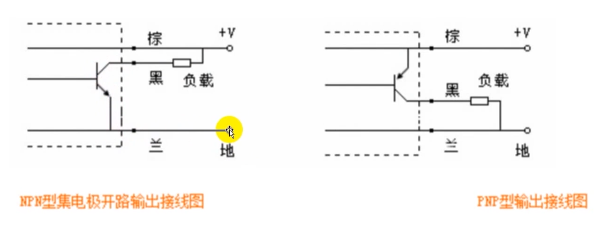

- PLC主机
	- 接线
		- 输入端
		- 
			- NPN，蓝黑棕，黑色信号线，
			- PNP
		- 输出端
		- 继电器形
			- 接220v
		- 晶体管形
			- 接24v
	- 位软原件介绍
		- （XY）plc输入输出使用8进制，例如X7下一个是X10
		- （M）辅助继电器使用10进制，M
		- （S）状态继电器，使用STL步进指令，十进制
		- 位组合成字，KnB，n是取n*4位，B是软元件编号
	- 字软元件
		- T 定时器
		- C 计数器
		- LC 长计数器
		- HSC 高速计数器
		- D & R 数据寄存器
-