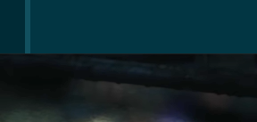
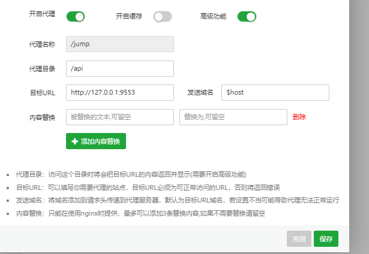

- #+BEGIN_QUERY
  {:title "Not uploaded images"
    :query [:find (pull ?b [*])
          :where
          [?b :block/page ?p]
          [?p :block/name ?page_name]
          (not [(clojure.string/includes? ?page_name "created by logseq-plugin-image-uploader")])
          [?b :block/content ?content]
          (not [(clojure.string/includes? ?content "{:title \"Not uploaded images\"")])
          [(clojure.string/includes? ?content "](../assets")]
          [(clojure.string/includes? ?content "![")]
          (or [(clojure.string/includes? ?content ".png)")]
              [(clojure.string/includes? ?content ".jpg)")]
              [(clojure.string/includes? ?content ".jpeg)")]
              [(clojure.string/includes? ?content ".gif)")]
              [(clojure.string/includes? ?content ".tiff)")]
              [(clojure.string/includes? ?content ".tif)")]
              [(clojure.string/includes? ?content ".bmp)")]
              [(clojure.string/includes? ?content ".svg)")]
              [(clojure.string/includes? ?content ".webp)")]
              [(clojure.string/includes? ?content ".PNG)")]
              [(clojure.string/includes? ?content ".JPG)")]
              [(clojure.string/includes? ?content ".JPEG)")]
              [(clojure.string/includes? ?content ".GIF)")]
              [(clojure.string/includes? ?content ".TIGG)")]
              [(clojure.string/includes? ?content ".TIF)")]
              [(clojure.string/includes? ?content ".VMP)")]
              [(clojure.string/includes? ?content ".SVG)")]
              [(clojure.string/includes? ?content ".WEBP)")])
        ]}
  #+END_QUERY
	- 
	- 
	- 
	- 
	- 
	- 
	- 
	- 
	- 
	- 
	- 
	- 
	- 
	- 
	- 
	- 
	- 
	- 
	- 
	- 
	- 
	- 
	- 