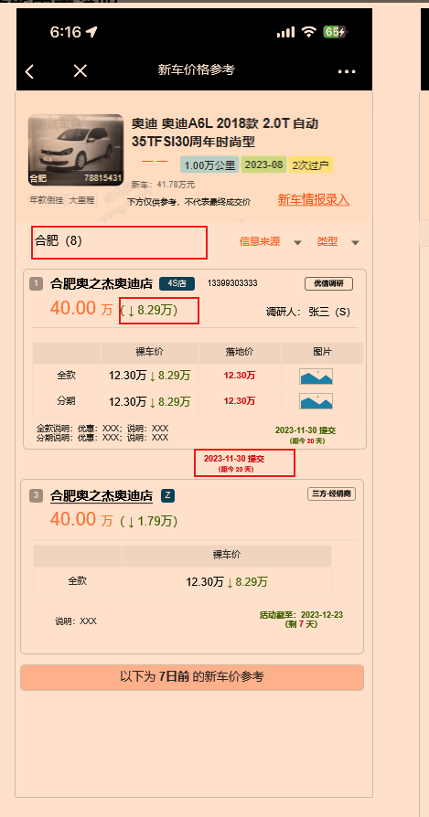

- [文档](https://docs.qq.com/doc/DR0FuYllvc3BKdGZR)
- 疑问
  collapsed:: true
	- 新车录入
		- 新车寻找教程
			- 这个轮播图的关闭按钮是什么样的，关闭逻辑是什么
		- 最多4位小数
			- 为什么保留4位，图上只展示了两位，四位能放下吗，如果保留四位，需要事先预留出宽度还是支持整行左移？
			- 如果保留4位，若输入`12.40`是否要清空这个
		- 优惠说明
			- 什么是hit文案，前端做还是后端做？如果没有是否不提交？
		- 说明
			- 同上hit文案
	- 新车价格参考
		- 
			- 绿色降价，是否出现升价
			- 2023-11-30提交这个为什么要出现在这里
			- 全款说明，分期说明：
				- 说明和优惠可能各有50字，这个文字换行要怎么调整？
			- 三方是不是没有落地架，没有分期，也没有图片呢
- 要做
	- DONE 新车价格参考要回显到蒙层之上
	- DONE 蒙层的展示逻辑
	- DONE 跳转页面的时候添加宏进说的参数
	- LATER iframe样式和滚动条的问题
	- LATER 文档过一遍
	- DONE iframe表单提交通知监听 (须和亮哥联调)
	- DONE 有蒙层的时候埋点暂停（还未做完，并须测试一下）
	- DONE 蒙层展示逻辑
	- DONE 跳过需要在请求一遍接口与关闭并行
	- DONE 位于后台时计时可能还会出现，抽空调整一下
	  :LOGBOOK:
	  CLOCK: [2023-12-05 Tue 18:58:09]--[2023-12-05 Tue 18:58:12] =>  00:00:03
	  :END:
	- LATER 图片样式调整一下
	- LATER h5页面出现的异常解决一下
	- LATER 零售页面同步
	- 联调
		- 优信
			- DONE 日期计算
			- DONE 手机号缺失
			- DONE 合肥城市怎么弄？