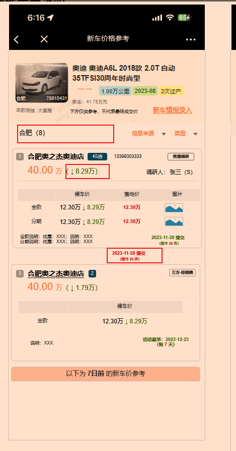

- 新车录入
	- 新车寻找教程
		- 这个轮播图的关闭按钮是什么样的，关闭逻辑是什么
	- 最多4位小数
		- 为什么保留4位，图上只展示了两位，四位能放下吗，如果保留四位，需要事先预留出宽度还是支持整行左移？
		- 如果保留4位，若输入`12.40`是否要清空这个
	- 优惠说明
		- 什么是hit文案，前端做还是后端做？如果没有是否不提交？
	- 说明
		- 同上hit文案
- 新车价格参考
	- 
		- 绿色降价，是否出现升价
		- 2023-11-30提交这个为什么要出现在这里
		- 全款说明，分期说明：
			- 说明和优惠可能各有50字，这个文字换行要怎么调整？
		- 三方是不是没有落地架，没有分期，也没有图片呢
-