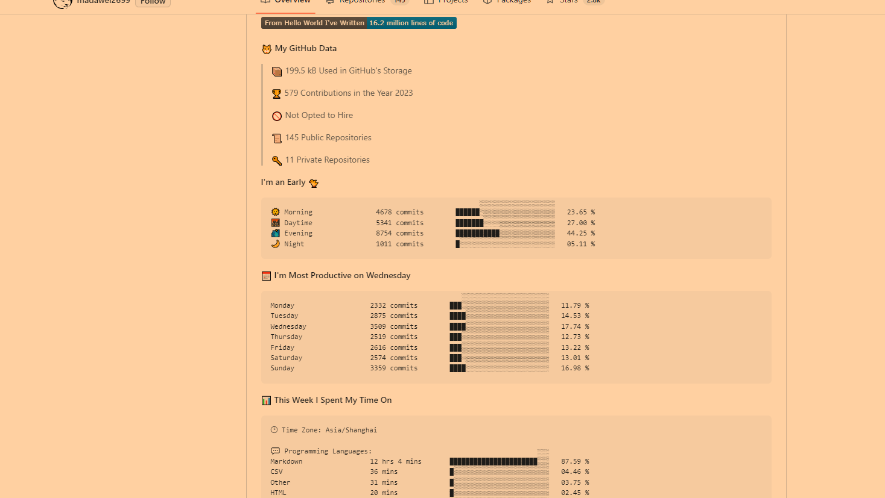

- #github
- ## 发现
	- 在学习logseq的时候发现别人的github面板的自我接受特别好看
	- [Dawei Ma](https://github.com/madawei2699)
	-  
- ## 行动
	- 决定自己也做一个
	- ### 分析
		- 通过分析，项目的目录，我们可以发现他有github的worflows，可以得知他的readme是通过action生成的
			- 
		- 根据里面的引用action组件我们就可以分析并且用到我们的项目里
			- 
	- ## wake
		- [waka-readme-stats](waka-readme-stats)
			- 根据教程走就行
		- 问题
			- 401
				- 
				- 通过注释下方的三行代码解决问题
				  ```yml
				  name: Waka Readme
				  
				  on:
				    schedule:
				      # Runs at 12am IST
				      - cron: '30 18 * * *'
				    workflow_dispatch:
				  jobs:
				    update-readme:
				      name: Update Readme with Metrics
				      runs-on: ubuntu-latest
				      steps:
				        - uses: anmol098/waka-readme-stats@master
				          with:
				            WAKATIME_API_KEY: ${{ secrets.WAKATIME_API_KEY }}
				            GH_TOKEN: ${{ secrets.GH_TOKEN }}
				  #           SHOW_LINES_OF_CODE: True
				  #           SHOW_TOTAL_CODE_TIME: True
				  #           SHOW_PROFILE_VIEWS: True
				  ```
			- 423
				- 
				- 通过重新申请github的response token解决
			- `RuntimeWarning: coroutine 'AsyncClient.get' was never awaited`
				- 
				- 可能今天没数据，等明天过来看看
-
-
-